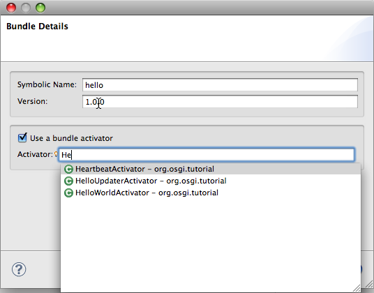
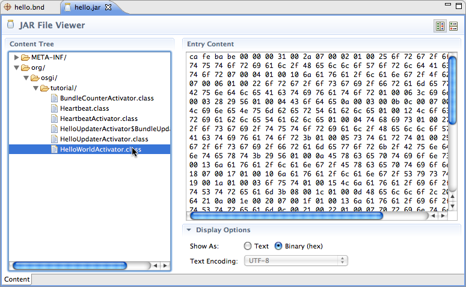

Bnd Tools for Eclipse
=====================

This is an Eclipse feature containing some simple tools for developing OSGi bundles with [bnd](http://www.aqute.biz/Code/Bnd). It offers the following features:

* A wizard for creating new bundle descriptors.
* A toolbar button and shortcuts for building a bundle from its descriptor.
* A JAR file contents viewer, implemented as an Eclipse editor.

Installation
------------

Install using the Eclipse updater with the following update site:

	http://bndtools-updates.s3.amazonaws.com/
                                          

Screenshots
-----------
        
### New Bundle Wizard ###

### Make Bundle Action ###

### JAR File Viewer ###

### JAR File Viewer - Hex Display ###
