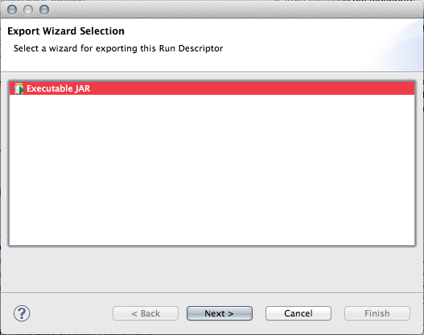
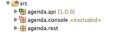
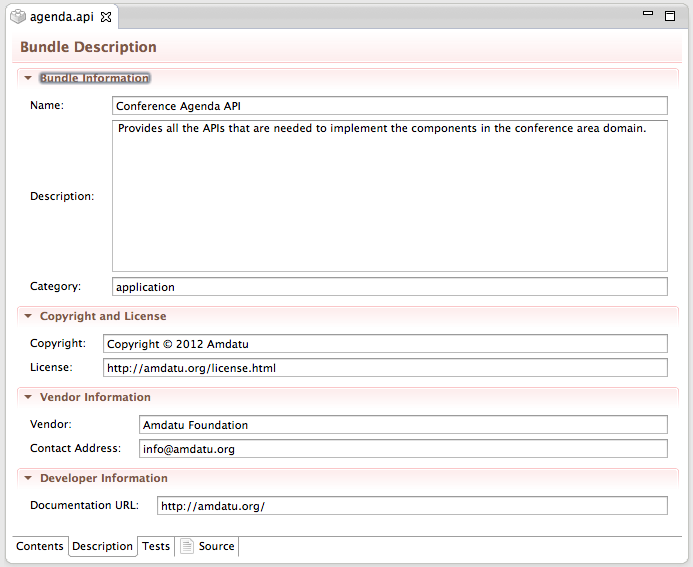
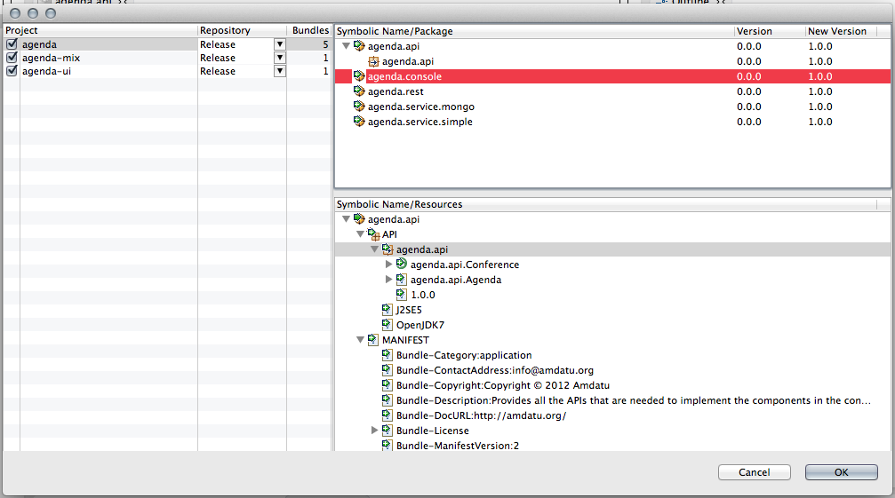
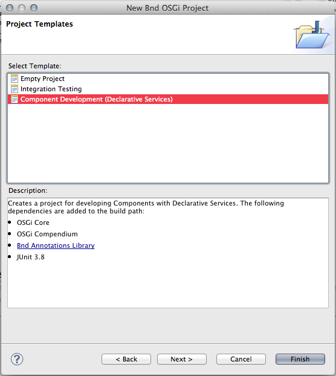
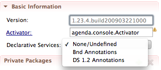

Version 1.0.0
=============

See [what's new in Bndtools version 1.0.0](/whatsnew1-0-0/).

Version 2.0.0
=============

### Resolution paths in Run Bundles ###

Previously the generated list of Run Bundles resulting from OBR resolution contained a `resolution` attribute giving the absolute URL of the resolved resource. These paths are not used by Bndtools but they may be used by other tools (e.g. ANT tasks) to generate packaging artefacts based on the resolution results. However users reported that the presence of this generated information in a source file led to problems with sharing the file through version control (see [bug 315](https://github.com/bndtools/bndtools/issues/315)).

In this release, resolution paths are no longer generated directly in the bnd or bndrun file. Instead they are output into a file under the `generated` directory, named `<runfile>.resolved`. The format for the information is the same, i.e.:

	<bsn>;version=<version>;resolution=<url>

### Export run descriptor to executable JAR ###

In any run descriptor, you can now export the configuration to an executable JAR. What this does is take all required bundles, plus the framework you chose, and creates a single JAR file out of them. This JAR file is executable so you can run this configuration easily. This is an easy way to distribute your OSGi applications.

### New decorators on packages ###

In the package explorer, we now have decorators that show you:

1. Whenever you export a package, it is marked with a green icon and its version is shown after the package name.
2. Whenever you have a package in your project that is excluded from any bundle that is part of that project, it is marked with a red icon.

### Bundle Description editor ###

The new bundle description tab now allows you to enter a lot more metadata to describe your bundle.

### Updated release features ###

You can now release the whole workspace at once. Also, when releasing multiple bundles, you can specify for each project if you want to release it and what repository to release it to.

### Improved configuration editing ###

The configuration files in Bndtools can now be properly reloaded when changed.

### Support for the new OBR standard ###

Repositories now support the latest OBR standard and has support for compressed indices for faster downloading as well.

### Project Templates ###

Project templates are now plugable, and it's quite easy to make them yourself.

### Support for Apache ACE ###

Apache ACE is a software distribution framework that allows you to centrally manage and distribute software components, configuration data and other artifacts to target systems. Bndtools now supports deploying directy to an Apache ACE server from within the IDE. This allows you to directly deploy updates to multiple targets and, for example, deploy to clusters to instantly test more complex configurations.

### Support for different types of annotations for Declarative Services ###

Since there are different annotations available for generating the XML data for Declarative Services, the projects now allow you to select which ones to use.

### (Re)generate bundles on resource changes ###

Although Bndtools would already regenerate a bundle whenever any of its classes had changed, it would not do the same for resources that were included in the bundle. Now there are properly detected as well and trigger a rebuild of the bundle.

### Bugfixes ###

One of the largest bugfixes is the greatly improved Windows support. The previous release still had a lot of small problems on Windows that made the whole developer experience less than perfect. These have been addressed.

We also improved the dependency resolution between projects.
